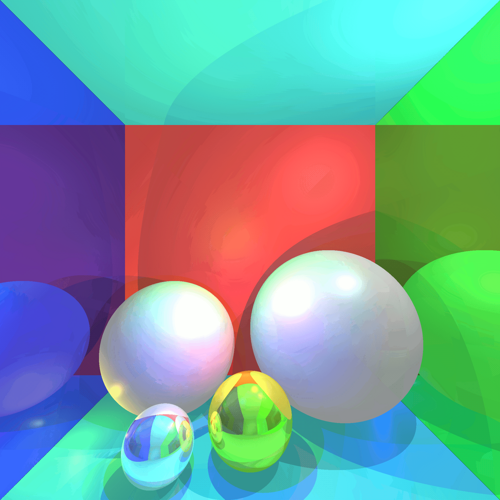

* Сборка и запуск

```
stack --resolver lts-8 init
stack --resolver lts-8 build
stack --resolver lts-8 exec haskell-raytracing 200 200 output.png
# теперь в папке с проектом появился рисунок output.png
```


